# Experiments

> **Note on checkpoints:** Checkpoints are not included in the repository (excluded by `.gitignore`). All runs can be reproduced using the commands in each experiment's "How to Reproduce" section.

This report covers training and evaluating a decoder-only transformer on the TinyStories dataset. I first established a baseline model and then ran four experiments against it. The first experiment scaled the model up to study the quality/cost trade-off. The second changed normalization placement from pre-norm to post-norm to see how it affects convergence. The third tested RoPE positional encoding against sinusoidal, and the fourth compared RMSNorm against LayerNorm.

## Summary

| Item | Value |
|---|---|
| Baseline command | `python scripts/train_model.py --config configs/tiny.yaml --num_epochs 1` |
| Baseline config | `configs/tiny.yaml` |
| Tokenizer | `assets/tokenizers/english_bytebpe_8k.json` |
| Checkpoint | `checkpoints/tiny/best_model.pt` (not in repo, excluded by .gitignore) |
| Baseline val loss | 3.978 |
| Baseline training time | 342s |
| Experiment 1 changed variable | Model size (tiny → small) |
| Experiment 2 changed variable | Normalization placement (pre-norm → post-norm) |
| Experiment 3 changed variable | Positional encoding (sinusoidal → RoPE) |
| Experiment 4 changed variable | Normalization type (LayerNorm → RMSNorm) |
| Training hardware | NVIDIA T4 (Google Colab), FP32 |
| Inference hardware | CPU, FP32 |
| Batch size | 16 |
| Sequence length | 512 tokens |

---

## Baseline

### Setup

For the baseline, I used the `tiny` configuration. The model is a small decoder-only transformer with 4 layers, a model dimension of 256, 4 attention heads, and a feedforward size of 1024. I used pre-norm LayerNorm and GELU activations. I also used the provided ByteLevel BPE tokenizer with an 8k vocabulary. The dataset was packed to a max sequence length of 512 and trained for one epoch with a learning rate of 3e-4 and a warmup cosine scheduler.

### How to Reproduce

To fully reproduce the baseline, run the following steps in order from the repo root.

**Step 1: Train**
```bash
python scripts/train_model.py --config configs/tiny.yaml --num_epochs 1
```

**Step 2: Generate**
```bash
python scripts/generate_text.py \
  --checkpoint checkpoints/tiny/best_model.pt \
  --tokenizer assets/tokenizers/english_bytebpe_8k.json \
  --prompt "Once upon a time," \
  --max_new_tokens 100
```

### Training

**Training Output**:

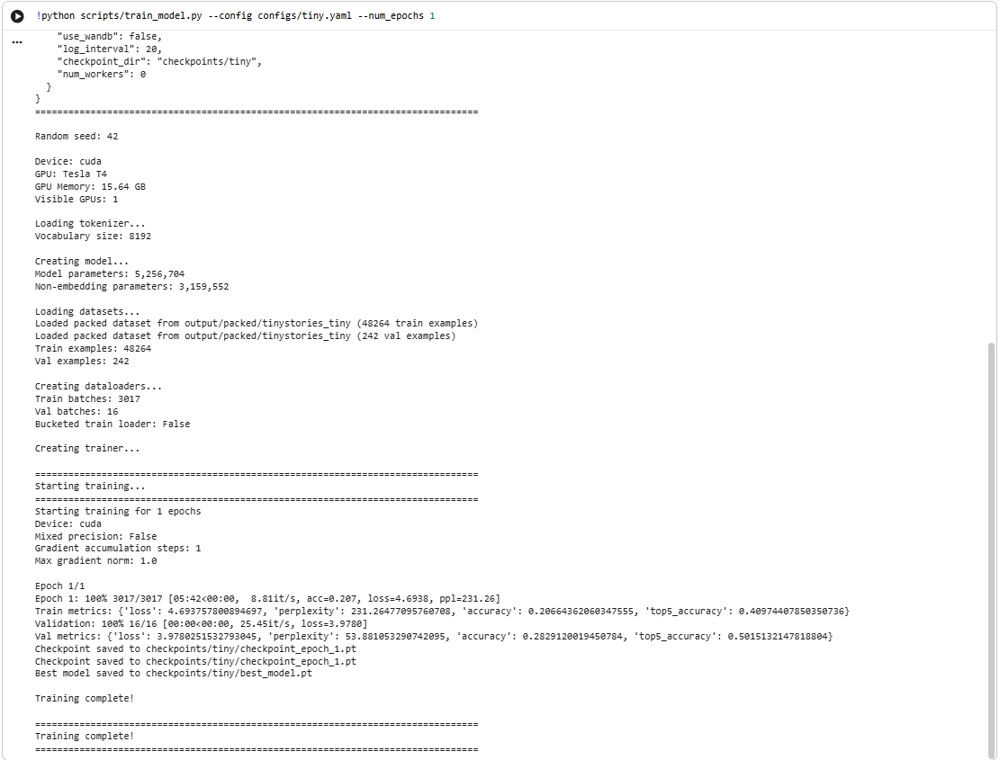

### Generation

**Generation Output**:

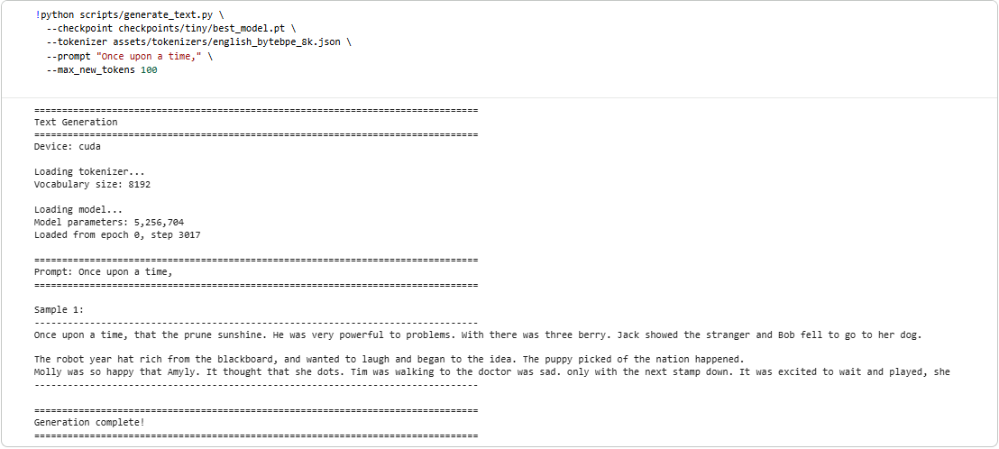

**Generation Sample**:

Prompt: `"Once upon a time,"`  
Decoding: greedy, `max_new_tokens=64`

```
Once upon a time, that the prune sunshine. He was very powerful to problems.
With there was three berry. Jack showed the stranger and Bob fell to go to her
dog.

The robot year hat rich from the blackboard, and wanted to laugh and began to
the idea. The puppy picked of the nation happened.
Molly was so happy that Amyly. It thought that she dots. Tim was walking to
the doctor was sad. only with the next stamp down. It was excited to wait and
played, she
```

Based on the output, the model clearly picked up on the style of TinyStories. It uses character names, simple scenarios, and short sentences. The sentences don't hold together coherently though, which is expected given the model's small size and only one epoch of training. Greedy decoding also plays a role here, since always picking the highest probability token tends to produce locally reasonable but globally incoherent text.

### Results

These are the numbers I'll be comparing against in my experiments. The main quality metrics I'm tracking are val loss and accuracy. On the cost side, I'm looking at parameter count and training time.

Val loss directly measures how well the model predicts the next token, so it's the clearest indicator of whether a change actually improved learning. Accuracy backs that up with a more intuitive number. Parameter count and training time matter because any quality improvement has to be weighed against the cost of getting it. A model that performs better but takes twice as long or has twice as many parameters isn't always the right trade-off.

| Metric | Value |
|---|---|
| Parameters | 5,256,704 |
| Val loss | 3.978 |
| Perplexity | 53.88 |
| Accuracy | 28.3% |
| Train time | 342s (Tesla T4) |

---

## Experiment 1: Model Size (Tiny → Small)

One of the most fundamental questions in deep learning is whether giving a model more capacity leads to better performance. This experiment tests that directly by scaling up the model size and measuring how much the quality improves and what it costs to get there.

### Hypothesis

A larger model will achieve lower validation loss than the tiny baseline, at the cost of more parameters and longer training time.

### What Changed

The only thing I changed in this experiment was the model size by swapping `tiny.yaml` for `small.yaml`. Everything else, including the tokenizer, dataset, training budget, optimizer, scheduler, and seed, stayed the same. Therefore, any difference in results can be attributed to the size change alone.

| Setting | Baseline (tiny) | Experiment 1 (small) |
|---|---|---|
| `d_model` | 256 | 384 |
| `num_layers` | 4 | 6 |
| `num_heads` | 4 | 6 |
| `d_ff` | 1024 | 1536 |


### Metrics

The main quality metric is val loss. Again, it directly measures how well the model predicts the next token, which is exactly what changes when you scale up model capacity. Accuracy backs that up as a more readable number.

The cost metrics are parameter count and training time. These capture the two things that actually get more expensive when you scale: how much memory the model needs and how long it takes to train.

Val loss and parameter count are the core of the trade-off I wanted to study. If loss drops meaningfully but parameters and training time go up proportionally, that tells a clear story about whether the size increase was worth it.

### What Would Count as Evidence

If the small model achieves noticeably lower val loss with an understandable increase in parameters and training time, that supports the hypothesis. If the loss barely changes but cost doubles, the trade-off is poor. If loss gets worse, something else is going on.

### Fairness and Confounds

The main risk here is that the two configs were trained for the same number of epochs rather than the same number of gradient steps. The small model sees the same number of epochs but more parameters per step, so it isn't a perfectly equal compute comparison. Training time in seconds on a shared Colab GPU also has some variance.

### How to Reproduce

To reproduce Experiment 1, run the following steps in order from the repo root.

**Step 1: Train**
```bash
python scripts/train_model.py --config configs/small.yaml --num_epochs 1
```

**Step 2: Generate**
```bash
python scripts/generate_text.py \
  --checkpoint checkpoints/small/best_model.pt \
  --tokenizer assets/tokenizers/english_bytebpe_8k.json \
  --prompt "Once upon a time," \
  --max_new_tokens 100
```

### Training

**Training Output**:

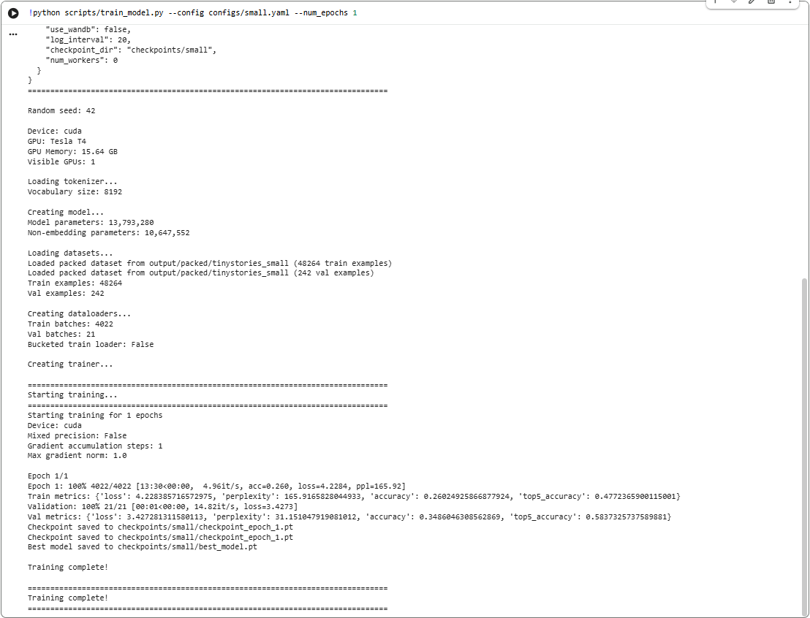

### Generation

**Generation Command**:
```bash
python scripts/generate_text.py \
  --checkpoint checkpoints/small/best_model.pt \
  --tokenizer assets/tokenizers/english_bytebpe_8k.json \
  --prompt "Once upon a time," \
  --max_new_tokens 100
```

**Generation Output**:

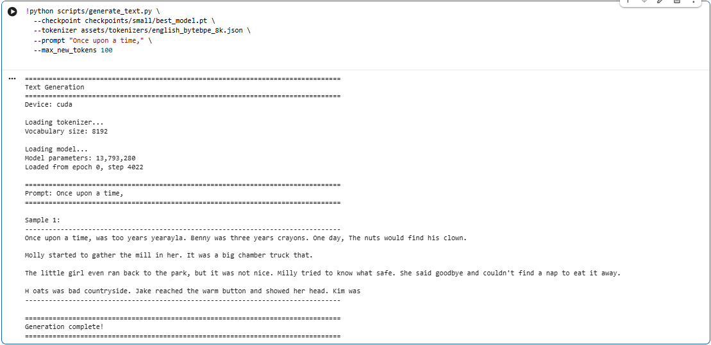

**Generation Sample**:

Prompt: `"Once upon a time,"`
Decoding: greedy, `max_new_tokens=100`

```
Once upon a time, was too years yearayla. Benny was three years crayons. One day, The nuts would find his clown.

Molly started to gather the mill in her. It was a big chamber truck that.

The little girl even ran back to the park, but it was not nice. Milly tried to know what safe. She said goodbye and couldn't find a nap to eat it away.

H oats was bad countryside. Jake reached the warm button and showed her head. Kim was
```

As you can see, the output is more coherent than the baseline. The sentences are longer and more structurally complete. The model also does a better job maintaining a consistent narrative thread within each paragraph. It still produces some nonsensical phrases, but the overall quality improvement is noticeable.

### Results

| Config | Parameters | Val Loss | Perplexity | Accuracy | Train Time |
|---|---|---|---|---|---|
| tiny (baseline) | 5.3M | 3.978 | 53.88 | 28.3% | 342s |
| small | 13.8M | 3.427 | 31.15 | 34.9% | 810s |

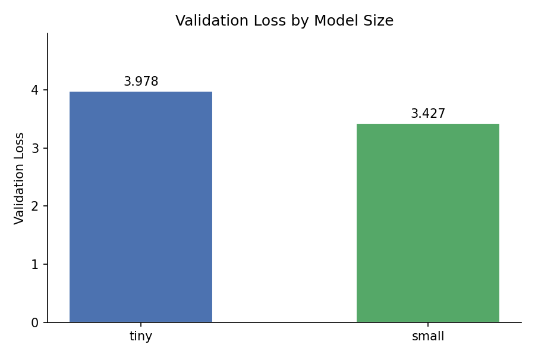

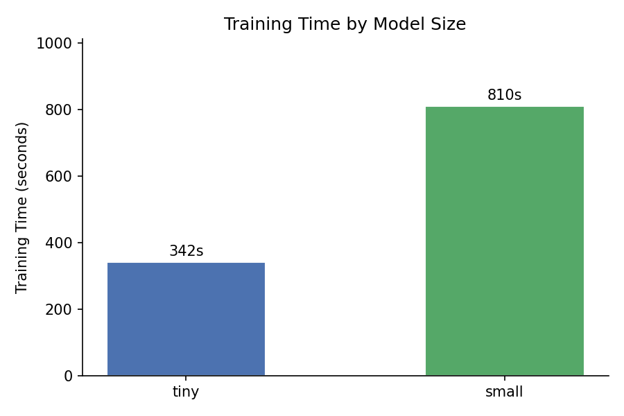

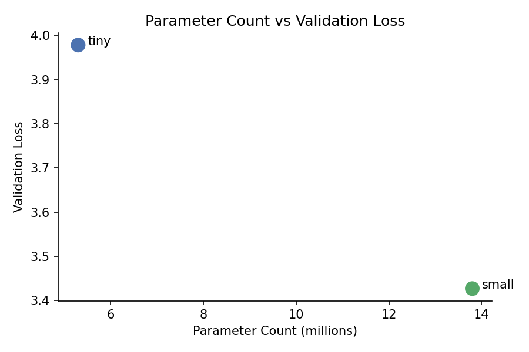

### Conclusion

The small model achieved a lower validation loss of 3.427 compared to 3.978 for the baseline. The perplexity dropped from 53.88 to 31.15 and accuracy improved from 28.3% to 34.9%. I'd definitely say the quality gain is real. The cost was a 2.6x increase in parameter count and a 2.4x increase in training time. Whether that trade-off is worth it depends on the compute budget, but the result does support the hypothesis.

### Limitations

- Each model was trained for only 1 epoch. With longer training the gap may widen or close.
- A single run per configuration means variance is not characterized.
- Training time comparisons are hardware-dependent and have some noise on a shared Colab GPU.
- The val loss improvement should not be extrapolated linearly to larger scale-ups. Diminishing returns are common and were not measured here.

---

## Experiment 2: Pre-norm vs Post-norm

Where layer normalization sits inside a transformer block is a small architectural decision that can have a meaningful effect on how well the model trains. This experiment explored whether moving normalization from before each sublayer to after it changes the quality of how the model learns.

### Hypothesis

Pre-norm placement will produce equal or better validation loss than post-norm, with similar training time. Pre-norm is expected to improve gradient flow, which should help convergence.

### What Changed

The only thing I changed was the `norm_position` setting from `pre` to `post`.  All other settings, including model size, tokenizer, dataset, optimizer, scheduler, and seed, were held fixed so that the only difference between the two runs is where the norm sits.

| Setting | Baseline (tiny) | Experiment 2 (tiny_postnorm) |
|---|---|---|
| `norm_position` | pre | post |


### Metrics

Again, the main quality metric is val loss. Since the only change is norm placement, any shift in val loss is directly attributable to that decision. Training stability (whether the loss diverges or produces NaN values) was also tracked because post-norm is known to be less stable in some settings.

I chose training time to be the cost metric. The norm operation itself is cheap, so I didn't expect a large difference, but I figured it would be worth confirming.

These metrics match the claim because val loss indicates whether the norm placement actually affected learning, and training stability indicates whether there was any risk introduced by the change.

### What Would Count as Evidence

If pre-norm achieves lower val loss with stable training and similar training time, that supports the hypothesis. If post-norm diverges or produces NaN loss, that would be the strongest evidence against using it. If both runs are stable but post-norm has meaningfully higher val loss, that would still support pre-norm as the better choice.

### Fairness and Confounds

This was an easy comparison since the only change was the `norm_position`. The main caveat is that the model is only 4 layers deep. The instability risk of post-norm is more pronounced in deeper networks, so the results here may not generalize well.

### How to Reproduce

To reproduce Experiment 2, run the following steps in order from the repo root.

**Step 1: Train**
```bash
python scripts/train_model.py --config configs/tiny_postnorm.yaml --num_epochs 1
```

**Step 2: Generate**
```bash
python scripts/generate_text.py \
  --checkpoint checkpoints/tiny_postnorm/best_model.pt \
  --tokenizer assets/tokenizers/english_bytebpe_8k.json \
  --prompt "Once upon a time," \
  --max_new_tokens 100
```

### Training

**Training Output**:

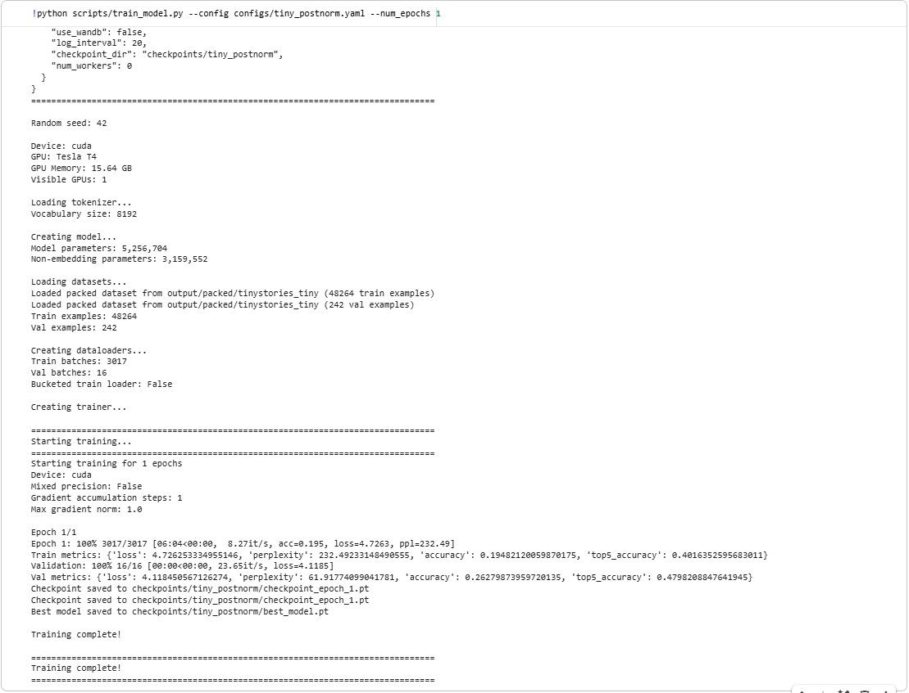

### Generation

**Generation Command**:
```bash
python scripts/generate_text.py \
  --checkpoint checkpoints/tiny_postnorm/best_model.pt \
  --tokenizer assets/tokenizers/english_bytebpe_8k.json \
  --prompt "Once upon a time," \
  --max_new_tokens 100
```

**Generation Output**:

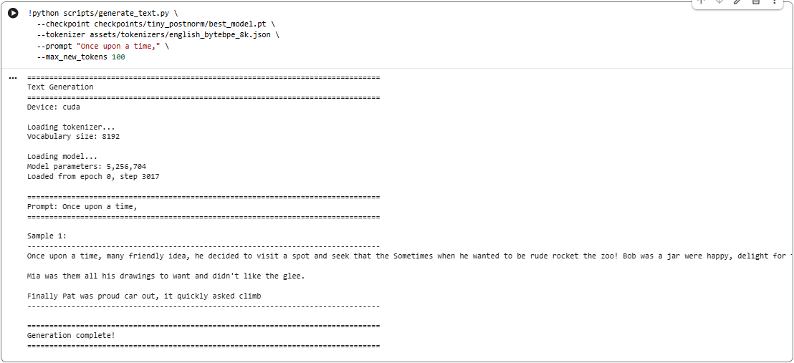

**Generation Sample**:

Prompt: `"Once upon a time,"`
Decoding: greedy, `max_new_tokens=100`

```
Once upon a time, many friendly idea, he decided to visit a spot and seek that the Sometimes when he wanted to be rude rocket the zoo! Bob was a jar were happy, delight for

Mia was them all his drawings to want and didn't like the glee.

Finally Pat was proud car out, it quickly asked climb
```

As you can see, the output is noticeably less coherent than the baseline. The sentences run together more awkwardly and the word choices feel more random. This is consistent with the higher val loss and supports the idea that post-norm hurts convergence even in this shallow model.

### Results

| Config | norm_position | Val Loss | Perplexity | Accuracy | Train Time | Notes |
|---|---|---|---|---|---|---|
| tiny (baseline) | pre | 3.978 | 53.88 | 28.3% | 342s | stable |
| tiny_postnorm | post | 4.119 | 61.92 | 26.3% | 364s | stable |

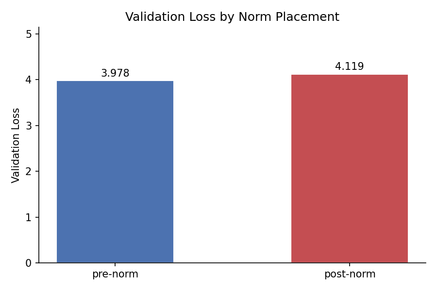

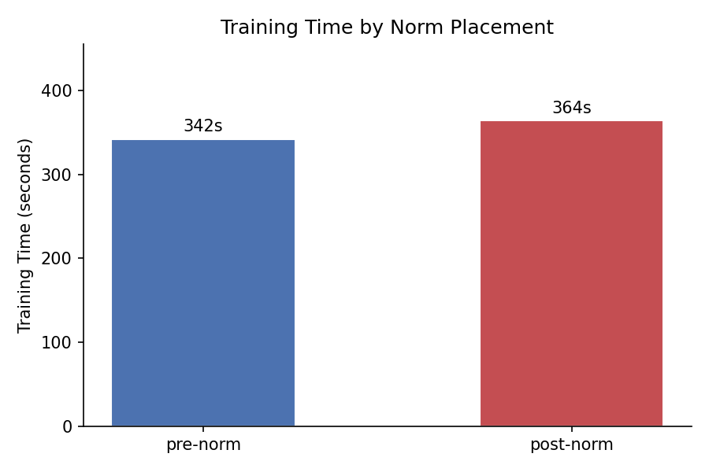

### Conclusion

Based on these results, post-norm produced a higher validation loss of 4.119 compared to 3.978 for pre-norm. The accuracy also dropped from 28.3% to 26.3%. Both runs were stable with no NaN loss or divergence, and training time was nearly identical. These results support the hypothesis that pre-norm leads to better convergence. The cost difference was also negligible, so pre-norm is the better choice here with no real downside.

### Limitations

- A single run per config means variance is not characterized. Different seeds may produce different results.
- The model is only 4 layers deep. The stability advantage of pre-norm is more pronounced in deeper networks, so these results may not generalize.
- Only 1 epoch of training, so the gap between the two may widen or close with longer training.
- Both runs were stable here, but it shouldn't be expected that post-norm is always safe in deeper/longer-trained models.

---

## Experiment 3: Sinusoidal vs RoPE

I implemented RoPE as an additional positional encoding and wanted to see whether it produces better validation loss than sinusoidal encoding under the same setup.

### Hypothesis

RoPE will produce equal or better validation loss than sinusoidal encoding because it encodes relative position through attention rotations rather than fixed additive patterns.

### What Changed

The only change was `pos_encoding_type` from `sinusoidal` to `rope`. Everything else was identical to the baseline.

| Setting | Baseline (tiny) | Experiment 3 (tiny_rope) |
|---|---|---|
| `pos_encoding_type` | sinusoidal | rope |

### Metrics

The main quality metric is val loss. Since the only change is positional encoding type, any shift in val loss is directly attributable to that choice. Again, I also chose to include accuracy as a more readable number. Training time is the cost metric because RoPE adds a rotation computation per attention layer. While it probably extremely small, I thought it'd be worth confirming the overhead is negligible.

### What Would Count as Evidence

If RoPE achieves equal or lower val loss with similar training time, that supports the hypothesis. If val loss is higher, the rotation-based encoding is not helping at this scale. If training time increases meaningfully, the overhead may not be worth it even if quality improves.

### Fairness and Confounds

This is a clean single-variable comparison because the only change is `pos_encoding_type`. The main caveat is that RoPE's advantage is typically most visible at longer sequence lengths where relative position matters more. At 512 tokens and 4 layers, the benefit may be underestimated.

### How to Reproduce

To reproduce Experiment 3, run the following steps in order from the repo root.

**Step 1: Train**
```bash
python scripts/train_model.py --config configs/tiny_rope.yaml --num_epochs 1
```

**Step 2: Generate**
```bash
python scripts/generate_text.py \
  --checkpoint checkpoints/tiny_rope/best_model.pt \
  --tokenizer assets/tokenizers/english_bytebpe_8k.json \
  --prompt "Once upon a time," \
  --max_new_tokens 100
```

### Training

**Training Output**:

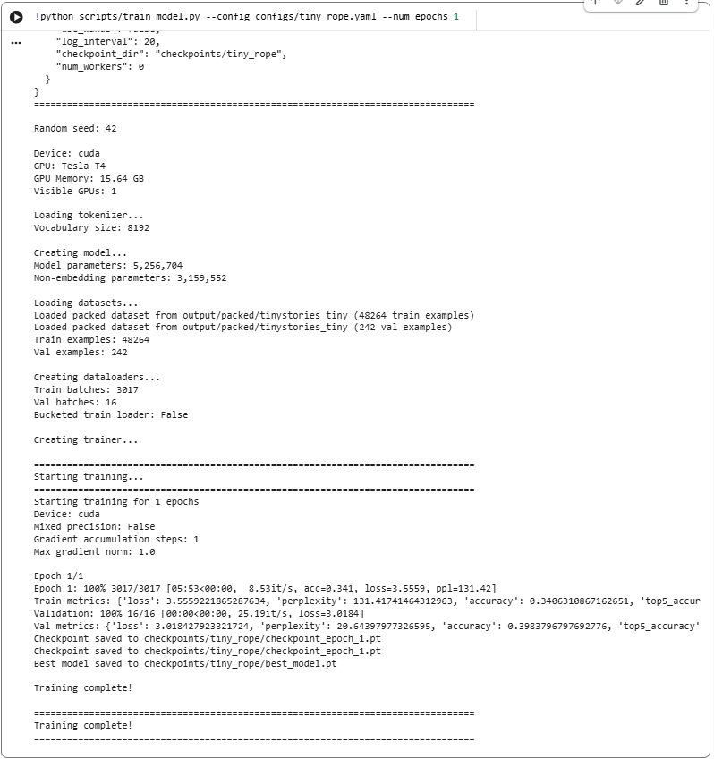

### Generation

**Generation Command**:
```bash
python scripts/generate_text.py \
  --checkpoint checkpoints/tiny_rope/best_model.pt \
  --tokenizer assets/tokenizers/english_bytebpe_8k.json \
  --prompt "Once upon a time," \
  --max_new_tokens 100
```

**Generation Output**:

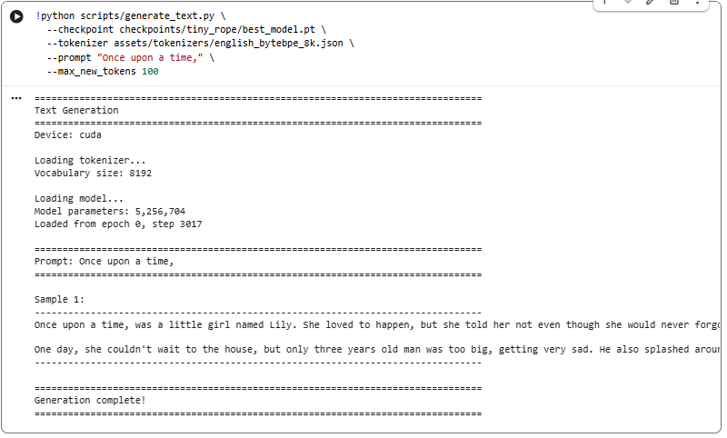

**Generation Sample**:

Prompt: `"Once upon a time,"`
Decoding: greedy, `max_new_tokens=100`

```
Once upon a time, was a little girl named Lily. She loved to happen, but she told her not even though she would never forgot her mittens to Whisten doctors.

One day, she couldn't wait to the house, but only three years old man was too big, getting very sad. He also splashed around whenever she wasn't hurt it quickly shook back. Suddenly, the doctor saw a sour leash from him and looked it under her ears. The bench hoped that there was too loud and a small dog
```

I thought the output was noticeably more coherent than the baseline. The sentences are longer, more structurally complete, and the narrative follows a recognizable TinyStories pattern. It also included a named character and a generic sequence of events. Some word choices are still off, but the overall quality improvement was consistent with the large drop in val loss.

### Results

| Config | pos_encoding_type | Val Loss | Perplexity | Accuracy | Train Time |
|---|---|---|---|---|---|
| tiny (baseline) | sinusoidal | 3.978 | 53.88 | 28.3% | 342s |
| tiny_rope | rope | 3.018 | 20.64 | 39.84% | 353s |

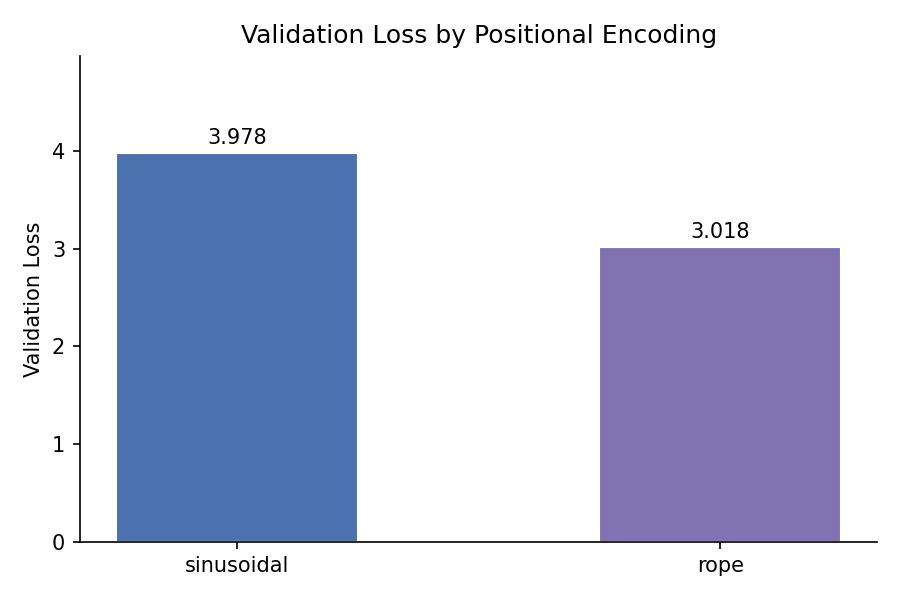

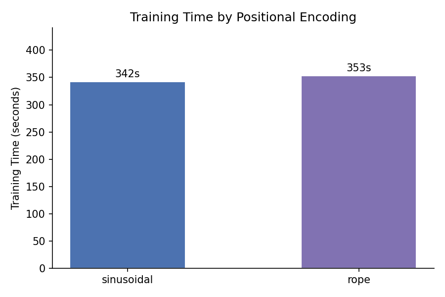

### Conclusion

RoPE produced a substantially lower validation loss of 3.018 compared to 3.978 for sinusoidal. The accuracy improved from 28.3% to 39.84%, and the perplexity dropped from 53.88 to 20.64. The quality improvement was definitely large and clearly supported the hypothesis. Training time was nearly identical at 353s vs 342s, so RoPE's rotation computation added no additional overhead at this scale. The generation output was also noticeably more coherent, as previously discussed.

### Limitations

- Single run per config, variance not characterized.
- Only 1 epoch of training.
- The model is shallow (4 layers), so RoPE's generalization advantage at longer sequence lengths may not be visible here.

---

## Experiment 4: LayerNorm vs RMSNorm

RMSNorm is a simpler normalization that drops the mean-centering step from LayerNorm. The goal of this experiment was to see whether it produced comparable quality at a slightly lower compute cost.

### Hypothesis

RMSNorm will produce similar validation loss to LayerNorm with a small reduction in training time because it has fewer operations per normalization step.

### What Changed

The only change was `norm_type` from `layernorm` to `rmsnorm`. Everything else was identical to the baseline.

| Setting | Baseline (tiny) | Experiment 4 (tiny_rmsnorm) |
|---|---|---|
| `norm_type` | layernorm | rmsnorm |

### Metrics

The main quality metric is val loss. I also used accuracy as a second quality signal. Again, I used training time is the cost metric because RMSNorm removes the mean subtraction step and should theoretically be slightly faster per step.

### What Would Count as Evidence

If RMSNorm achieves similar val loss with equal or lower training time, that supports the hypothesis. If val loss increases, the simplification is hurting the model's ability to normalize activations effectively. If training time is identical, the compute saving is too small to measure at this scale.

### Fairness and Confounds

Again. this was a single-variable comparison since the only change is `norm_type`. The main caveat is that the compute difference between LayerNorm and RMSNorm is small enough that it may not be detectable at this model size on a shared GPU with run-to-run timing noise.

### How to Reproduce

To reproduce Experiment 4, run the following steps in order from the repo root.

**Step 1: Train**
```bash
python scripts/train_model.py --config configs/tiny_rmsnorm.yaml --num_epochs 1
```

**Step 2: Generate**
```bash
python scripts/generate_text.py \
  --checkpoint checkpoints/tiny_rmsnorm/best_model.pt \
  --tokenizer assets/tokenizers/english_bytebpe_8k.json \
  --prompt "Once upon a time," \
  --max_new_tokens 100
```

### Training

**Training Output**:

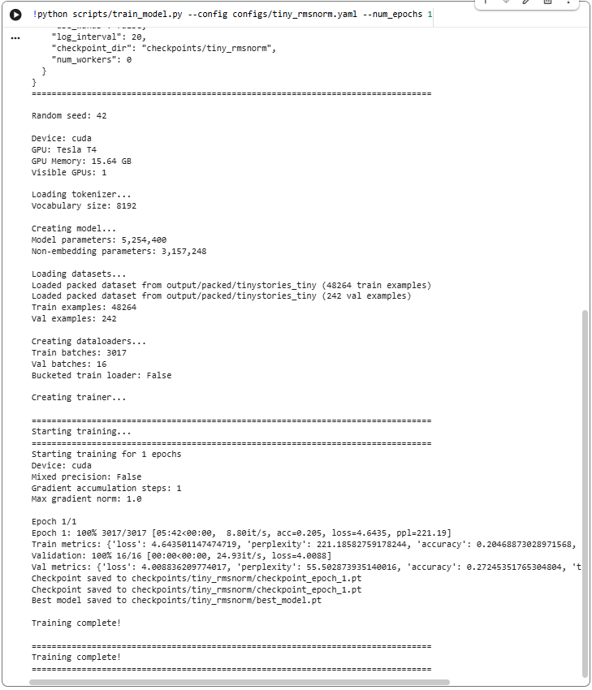

### Generation

**Generation Command**:
```bash
python scripts/generate_text.py \
  --checkpoint checkpoints/tiny_rmsnorm/best_model.pt \
  --tokenizer assets/tokenizers/english_bytebpe_8k.json \
  --prompt "Once upon a time," \
  --max_new_tokens 100
```

**Generation Output**:

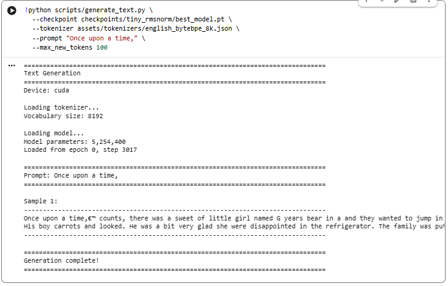

**Generation Sample**:

Prompt: `"Once upon a time,"`
Decoding: greedy, `max_new_tokens=100`

```
Once upon a time,€™ counts, there was a sweet of little girl named G years bear in a and they wanted to jump in the belly. He hopped over to you in the comfortable. But he saw a neighbour were late man promised to the garden. So the large screen was so happy up. She felt modest.

His boy carrots and looked. He was a bit very glad she were disappointed in the refrigerator. The family was putting them and put the beautiful dolphin and had the fruit. It was so happy and
```

I thought the output was less coherent than the baseline. Sentences fragmented more frequently, and word choices felt much more random. The narrative structure also broke down quickly. This is consistent with the higher val loss and supports the conclusion that RMSNorm slightly hurt learning in this setup.

### Results

| Config | norm_type | Val Loss | Perplexity | Accuracy | Train Time |
|---|---|---|---|---|---|
| tiny (baseline) | layernorm | 3.978 | 53.88 | 28.3% | 342s |
| tiny_rmsnorm | rmsnorm | 4.009 | 55.50 | 27.25% | 342s |

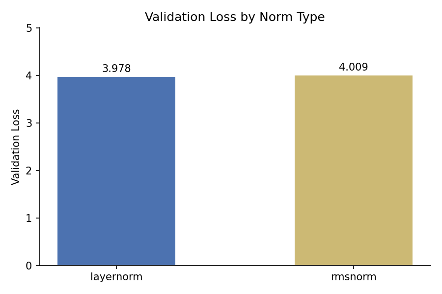

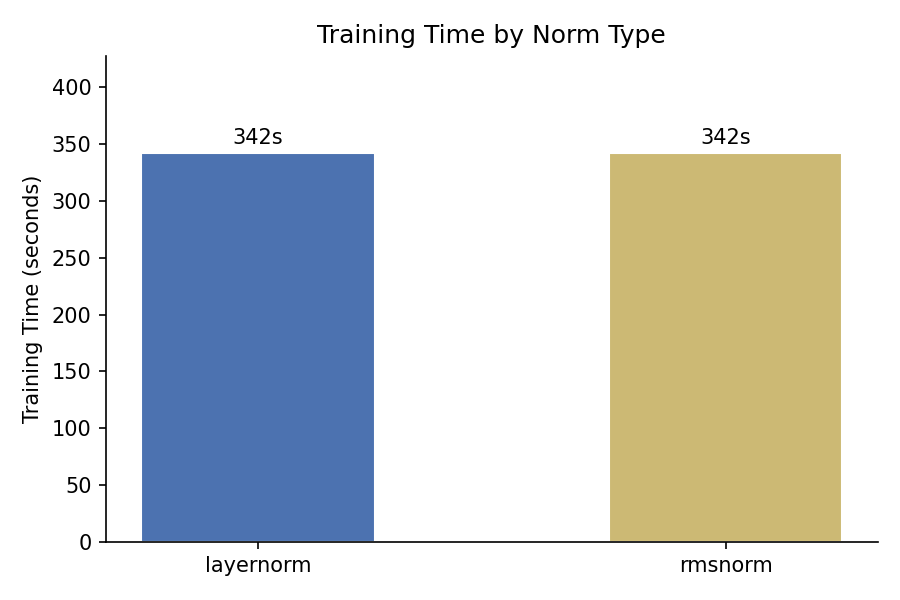

### Conclusion

RMSNorm produced a higher validation loss of 4.009 compared to 3.978 for LayerNorm, and accuracy dropped slightly from 28.3% to 27.25%. The difference was small but goes against the expectation that RMSNorm would match or improve on LayerNorm. Training time was identical at 342s. This was consistent with RMSNorm's theoretical compute advantage being negligible at this small scale. The generation output is also less slightly less coherent than the baseline, which suggests the small quality regression is real rather than just being noise.

### Limitations

- Single run per config, variance not characterized.
- Only 1 epoch of training.
- The compute difference between LayerNorm and RMSNorm may be too small to measure reliably at this scale.

---

## Optional Implementations

I also implemented several optional architecture features. Two of them (RoPE and RMSNorm) were used as experiment variables. The rest are fully implemented in the codebase but were not used as experiment variables.

| Feature | Location | Used in experiment |
|---|---|---|
| Rotary Positional Embedding (RoPE) | `src/components/positional.py` | Experiment 3 |
| RMSNorm | `src/components/normalization.py` | Experiment 4 |
| Grouped Query Attention (GQA) | `src/components/attention.py` | No |
| SwiGLU / GeGLU | `src/components/feedforward.py` | No |
| Mixture of Experts (MoE) | `src/components/feedforward.py` | No |
| Beam Search | `src/generation/generator.py` | No |
| Bucket Batching | `src/data/dataloader.py` | No |

---

## Generation Comparison

To make the quality difference across the runs easier to see, here are the generation outputs side by side using the same prompt and decoding settings.

Prompt: `"Once upon a time,"`
Decoding: greedy, `max_new_tokens=100`

**Baseline (tiny, sinusoidal, layernorm, pre-norm)**
```
Once upon a time, that the prune sunshine. He was very powerful to problems.
With there was three berry. Jack showed the stranger and Bob fell to go to her dog.

The robot year hat rich from the blackboard, and wanted to laugh and began to the idea.
The puppy picked of the nation happened. Molly was so happy that Amyly. It thought
that she dots. Tim was walking to the doctor was sad. only with the next stamp down.
It was excited to wait and played, she
```

**Experiment 1 (small, pre-norm)**
```
Once upon a time, was too years yearayla. Benny was three years crayons. One day,
The nuts would find his clown.

Molly started to gather the mill in her. It was a big chamber truck that.

The little girl even ran back to the park, but it was not nice. Milly tried to know
what safe. She said goodbye and couldn't find a nap to eat it away.

H oats was bad countryside. Jake reached the warm button and showed her head. Kim was
```

**Experiment 2 (tiny, post-norm)**
```
Once upon a time, many friendly idea, he decided to visit a spot and seek that the
Sometimes when he wanted to be rude rocket the zoo! Bob was a jar were happy, delight for

Mia was them all his drawings to want and didn't like the glee.

Finally Pat was proud car out, it quickly asked climb
```

**Experiment 3 (tiny, RoPE)**
```
Once upon a time, was a little girl named Lily. She loved to happen, but she told her
not even though she would never forgot her mittens to Whisten doctors.

One day, she couldn't wait to the house, but only three years old man was too big,
getting very sad. He also splashed around whenever she wasn't hurt it quickly shook back.
Suddenly, the doctor saw a sour leash from him and looked it under her ears. The bench
hoped that there was too loud and a small dog
```

**Experiment 4 (tiny, RMSNorm)**
```
Once upon a time,€™ counts, there was a sweet of little girl named G years bear in a
and they wanted to jump in the belly. He hopped over to you in the comfortable. But he
saw a neighbour were late man promised to the garden. So the large screen was so happy up.
She felt modest.

His boy carrots and looked. He was a bit very glad she were disappointed in the
refrigerator. The family was putting them and put the beautiful dolphin and had the fruit.
It was so happy and
```

The RoPE model produced the most coherent output of all five runs. The output included a named character, complete sentences, and a recognizable story structure. The small model was also strong, with clear paragraph breaks and reasonable sentence flow. The post-norm and RMSNorm outputs were the weakest. They had fragmented phrases and incoherent word choices. These differences aligned with the val loss rankings across all five runs.

---

## Overall Conclusion

After running four experiments against the tiny baseline, the results told a consistent story across all of them.

Scaling the model up (Experiment 1) improved my validation loss from 3.978 to 3.427, but at a cost of 2.6x more parameters and 2.4x longer training time. The quality gain was real but the compute cost was proportional. Switching to post-norm (Experiment 2) made things worse with no cost benefit. This confirmed that pre-norm was the right default for this architecture.

Experiments 3 and 4 were more revealing. RoPE (Experiment 3) produced the largest quality improvement of any change I tested. It caused the val loss to drop to 3.018 and pushed the accuracy to 39.84%, with essentially no added training time. This was the single best architectural swap across all four experiments. RMSNorm (Experiment 4) went the other direction. It unfortunately caused a slight increase in the val loss (4.009), with no time savings at this scale.

Overall, my results suggest that positional encoding choice matters more than normalization type for this model size and training budget. RoPE is clearly worth using. RMSNorm's theoretical efficiency advantage did not materialize at this small scale, and it also came with a small quality regression here.

### Limitations

A few caveats are worth keeping in mind before drawing strong conclusions from these experiments. All of my models were trained for just one epoch due to compute constraints. Therefore, the differences between configurations might grow or shrink with longer training. Results also come from a single random seed, which means a different initialization could tell a somewhat different story. Training times were measured on a shared Colab T4, so those numbers carry some noise from run to run. Finally, all the text samples were generated with greedy decoding. This approach tends to make outputs look more similar than they really are since it always picks the most likely next token.
